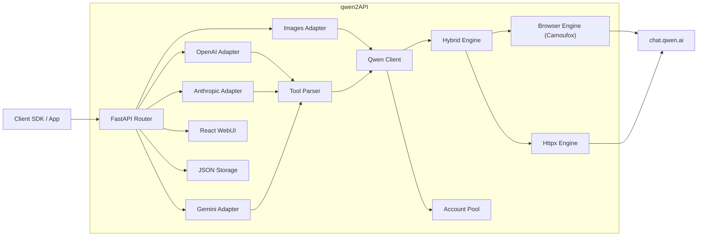

# qwen2API Enterprise Gateway

[](https://github.com/YuJunZhiXue/qwen2API/blob/main/LICENSE)
[](https://github.com/YuJunZhiXue/qwen2API/stargazers)
[](https://github.com/YuJunZhiXue/qwen2API/network/members)
[](https://github.com/YuJunZhiXue/qwen2API/releases)
[](https://hub.docker.com/r/yujunzhixue/qwen2api)

[](https://zeabur.com/templates/qwen2api)
[](https://vercel.com/new/clone?repository-url=https%3A%2F%2Fgithub.com%2FYuJunZhiXue%2Fqwen2API)

语言 / Language: [中文](./README.md) | [English](./README.en.md)

qwen2API 用于将通义千问（chat.qwen.ai）网页版能力转换为 OpenAI、Anthropic Claude 与 Gemini 兼容接口。项目后端基于 FastAPI，前端基于 React + Vite，内置管理台、账号池、工具调用解析、图片生成链路与多种部署方式。

---

## 目录

- [项目说明](#项目说明)
- [架构概览](#架构概览)
- [核心能力](#核心能力)
- [接口支持](#接口支持)
- [模型映射](#模型映射)
- [图片生成](#图片生成)
- [快速开始](#快速开始)
  - [方式一：Docker 直接运行预构建镜像（推荐）](#方式一docker-直接运行预构建镜像推荐)
  - [方式二：本地源码运行](#方式二本地源码运行)
- [环境变量说明（.env）](#环境变量说明env)
- [docker-compose.yml 说明](#docker-composeyml-说明)
- [端口说明](#端口说明)
- [WebUI 管理台](#webui-管理台)
- [数据持久化](#数据持久化)
- [常见问题](#常见问题)
- [许可证与免责声明](#许可证与免责声明)

---

## 项目说明

本项目提供以下能力：

1. 将千问网页对话能力转换为 OpenAI Chat Completions 接口。
2. 将千问网页对话能力转换为 Anthropic Messages 接口。
3. 将千问网页对话能力转换为 Gemini GenerateContent 接口。
4. 提供独立的图片生成接口 `POST /v1/images/generations`。
5. 支持工具调用（Tool Calling）与工具结果回传。
6. 提供管理台，用于账号管理、API Key 管理、图片生成测试与运行状态查看。
7. 提供多账号轮询、限流冷却、重试与浏览器 / httpx 混合引擎。

---

## 架构概览



---

## 核心能力

- OpenAI / Anthropic / Gemini 三套接口兼容。
- 工具调用解析与工具结果回传。
- Browser Engine、Httpx Engine、Hybrid Engine 三种执行模式。
- 多账号并发池、动态冷却、故障重试。
- 基于千问网页真实工具链路的图片生成。
- WebUI 管理台。
- 健康检查与就绪检查接口。

---

## 接口支持

| 接口类型 | 路径 | 说明 |
|---|---|---|
| OpenAI Chat | `POST /v1/chat/completions` | 支持流式与非流式、工具调用、图片意图自动识别 |
| OpenAI Models | `GET /v1/models` | 返回可用模型别名 |
| OpenAI Images | `POST /v1/images/generations` | 图片生成接口 |
| Anthropic Messages | `POST /anthropic/v1/messages` | Claude / Anthropic SDK 兼容 |
| Gemini GenerateContent | `POST /v1beta/models/{model}:generateContent` | Gemini SDK 兼容 |
| Gemini Stream | `POST /v1beta/models/{model}:streamGenerateContent` | 流式输出 |
| Admin API | `/api/admin/*` | 管理接口 |
| Health | `/healthz` | 存活探针 |
| Ready | `/readyz` | 就绪探针 |

---

## 模型映射

当前默认将主流客户端模型名称统一映射至 `qwen3.6-plus`。

| 传入模型名 | 实际调用 |
|---|---|
| `gpt-4o` / `gpt-4-turbo` / `gpt-4.1` / `o1` / `o3` | `qwen3.6-plus` |
| `gpt-4o-mini` / `gpt-3.5-turbo` | `qwen3.6-plus` |
| `claude-opus-4-6` / `claude-sonnet-4-6` / `claude-3-5-sonnet` | `qwen3.6-plus` |
| `claude-3-haiku` / `claude-haiku-4-5` | `qwen3.6-plus` |
| `gemini-2.5-pro` / `gemini-2.5-flash` / `gemini-1.5-pro` | `qwen3.6-plus` |
| `deepseek-chat` / `deepseek-reasoner` | `qwen3.6-plus` |

未命中映射表时，默认回退为传入模型名本身；若管理台设置了自定义映射规则，则以配置为准。

---

## 图片生成

qwen2API 提供与 OpenAI Images 接口兼容的图片生成能力。

- 接口：`POST /v1/images/generations`
- 默认模型别名：`dall-e-3`
- 实际底层：`qwen3.6-plus` + 千问网页 `image_gen` 工具
- 返回图片链接域名：通常为 `cdn.qwenlm.ai`

### 请求示例

```bash
curl http://127.0.0.1:7860/v1/images/generations \
  -H "Content-Type: application/json" \
  -H "Authorization: Bearer YOUR_API_KEY" \
  -d '{
    "model": "dall-e-3",
    "prompt": "一只赛博朋克风格的猫，霓虹灯背景，超写实",
    "n": 1,
    "size": "1024x1024",
    "response_format": "url"
  }'
```

### 返回示例

```json
{
  "created": 1712345678,
  "data": [
    {
      "url": "https://cdn.qwenlm.ai/output/.../image.png?key=...",
      "revised_prompt": "一只赛博朋克风格的猫，霓虹灯背景，超写实"
    }
  ]
}
```

### 支持的图片比例

前端图片生成页面内置以下比例：

- `1:1`
- `16:9`
- `9:16`
- `4:3`
- `3:4`

### Chat 接口图片意图识别

`/v1/chat/completions` 支持根据用户消息自动识别图片生成意图。例如：

- “帮我画一张……”
- “生成一张图片……”
- “draw an image of ……”

当识别为图片生成请求时，系统会自动切换到图片生成管道。

---

## 快速开始

### 方式一：Docker 直接运行预构建镜像（推荐）

此方式适用于生产环境、测试服务器与普通部署场景。  
优点是：**不需要本地编译前端，不需要在服务器构建镜像，不需要服务器自行下载 Camoufox。**

#### 第一步：准备目录

```bash
mkdir qwen2api && cd qwen2api
mkdir -p data logs
```

#### 第二步：创建 `docker-compose.yml`

```yaml
services:
  qwen2api:
    image: yujunzhixue/qwen2api:latest
    container_name: qwen2api
    restart: unless-stopped
    env_file:
      - path: .env
        required: false
    ports:
      - "7860:7860"
    volumes:
      - ./data:/workspace/data
      - ./logs:/workspace/logs
    shm_size: '256m'
    environment:
      PYTHONIOENCODING: utf-8
      PORT: "7860"
      ENGINE_MODE: "hybrid"
    healthcheck:
      test: ["CMD", "curl", "-f", "http://localhost:7860/healthz"]
      interval: 30s
      timeout: 10s
      start_period: 120s
      retries: 3
```

#### 第三步：创建 `.env`

建议至少写入以下内容：

```env
ADMIN_KEY=change-me-now
PORT=7860
WORKERS=1
ENGINE_MODE=hybrid
BROWSER_POOL_SIZE=2
MAX_INFLIGHT=1
ACCOUNT_MIN_INTERVAL_MS=1200
REQUEST_JITTER_MIN_MS=120
REQUEST_JITTER_MAX_MS=360
MAX_RETRIES=2
TOOL_MAX_RETRIES=2
EMPTY_RESPONSE_RETRIES=1
RATE_LIMIT_BASE_COOLDOWN=600
RATE_LIMIT_MAX_COOLDOWN=3600
STREAM_KEEPALIVE_INTERVAL=5
```

#### 第四步：启动服务

```bash
docker compose up -d
```

#### 第五步：查看状态

```bash
docker compose ps
docker compose logs -f
curl http://127.0.0.1:7860/healthz
```

#### 第六步：更新服务

```bash
docker compose pull
docker compose up -d
```

---

### 方式二：本地源码运行

此方式适用于本地开发与调试。

#### 环境要求

- Python 3.12+
- Node.js 20+
- 可访问 Camoufox 下载源

#### 步骤

```bash
git clone https://github.com/YuJunZhiXue/qwen2API.git
cd qwen2API
python start.py
```

`python start.py` 会自动完成以下工作：

1. 安装后端依赖
2. 下载 Camoufox 浏览器内核
3. 安装前端依赖
4. 构建前端
5. 启动后端服务

---

## 环境变量说明（.env）

项目提供 `.env.example` 作为模板。以下为主要参数说明。

### 基础参数

| 参数 | 默认值 | 说明 |
|---|---|---|
| `ADMIN_KEY` | `change-me-now` / `admin` | 管理台管理员密钥。建议部署后立即修改。 |
| `PORT` | `7860` | 后端服务监听端口。 |
| `WORKERS` | `1` 或 `3` | Uvicorn worker 数量。单实例环境建议 1。 |
| `REGISTER_SECRET` | 空 | 用户注册密钥。为空时表示不限制注册。 |

### 引擎参数

| 参数 | 默认值 | 说明 |
|---|---|---|
| `ENGINE_MODE` | `hybrid` | 引擎模式。可选 `hybrid`、`httpx`、`browser`。 |
| `BROWSER_POOL_SIZE` | `2` | 浏览器页面池大小。值越大并发越高，但内存占用也越高。 |
| `STREAM_KEEPALIVE_INTERVAL` | `5` | 流式输出 keepalive 间隔。 |

#### `ENGINE_MODE` 说明

- `hybrid`：推荐模式。聊天、建会话、删会话优先走浏览器；httpx 作为故障兜底。
- `httpx`：全部优先走 httpx / curl_cffi。速度更快，但浏览器特征更弱，适合对速度优先的测试场景。
- `browser`：全部走浏览器。更接近真实网页环境，但资源占用更高。

如果需要在 `httpx` 和 `hybrid` 之间切换，只需修改：

```env
ENGINE_MODE=httpx
```

或：

```env
ENGINE_MODE=hybrid
```

修改后重启服务：

```bash
docker compose restart
```

### 并发与风控参数

| 参数 | 默认值 | 说明 |
|---|---|---|
| `MAX_INFLIGHT` | `1` | 每个账号允许的最大并发请求数。 |
| `ACCOUNT_MIN_INTERVAL_MS` | `1200` | 同一账号两次请求之间的最小间隔。 |
| `REQUEST_JITTER_MIN_MS` | `120` | 随机抖动最小值。 |
| `REQUEST_JITTER_MAX_MS` | `360` | 随机抖动最大值。 |
| `MAX_RETRIES` | `2` | 请求失败最大重试次数。 |
| `TOOL_MAX_RETRIES` | `2` | 工具调用相关最大重试次数。 |
| `EMPTY_RESPONSE_RETRIES` | `1` | 空响应最大重试次数。 |
| `RATE_LIMIT_BASE_COOLDOWN` | `600` | 账号限流基础冷却时间（秒）。 |
| `RATE_LIMIT_MAX_COOLDOWN` | `3600` | 账号限流最大冷却时间（秒）。 |

### 数据路径参数

| 参数 | 默认值 | 说明 |
|---|---|---|
| `ACCOUNTS_FILE` | `/workspace/data/accounts.json` | 账号数据文件路径。 |
| `USERS_FILE` | `/workspace/data/users.json` | API Key / 用户数据文件路径。 |
| `CAPTURES_FILE` | `/workspace/data/captures.json` | 抓取结果文件路径。 |
| `CONFIG_FILE` | `/workspace/data/config.json` | 运行时配置文件路径。 |

---

## docker-compose.yml 说明

以下是推荐的 Compose 配置：

```yaml
services:
  qwen2api:
    image: yujunzhixue/qwen2api:latest
    container_name: qwen2api
    restart: unless-stopped
    env_file:
      - path: .env
        required: false
    ports:
      - "7860:7860"
    volumes:
      - ./data:/workspace/data
      - ./logs:/workspace/logs
    shm_size: '256m'
    environment:
      PYTHONIOENCODING: utf-8
      PORT: "7860"
      ENGINE_MODE: "hybrid"
    healthcheck:
      test: ["CMD", "curl", "-f", "http://localhost:7860/healthz"]
      interval: 30s
      timeout: 10s
      start_period: 120s
      retries: 3
```

### 字段说明

| 字段 | 说明 |
|---|---|
| `image` | 预构建镜像地址。普通部署推荐使用。 |
| `container_name` | 容器名称。 |
| `restart` | 开机或故障时自动重启。 |
| `env_file` | 从 `.env` 加载环境变量。 |
| `ports` | 将宿主机端口映射到容器端口。 |
| `volumes` | 持久化数据与日志目录。 |
| `shm_size` | 浏览器共享内存。Camoufox / Firefox 运行建议至少 256m。 |
| `environment` | Compose 中直接写入的环境变量，优先级高于镜像默认值。 |
| `healthcheck` | 容器健康检查。 |

### 用户需要修改的部分

通常只需要根据部署环境修改以下内容：

1. **端口映射**
   ```yaml
   ports:
     - "7860:7860"
   ```
   如果服务器 7860 已占用，可以改为：
   ```yaml
   ports:
     - "8080:7860"
   ```

2. **引擎模式**
   ```yaml
   environment:
     ENGINE_MODE: "hybrid"
   ```
   可改为：
   ```yaml
   environment:
     ENGINE_MODE: "httpx"
   ```

3. **共享内存**
   ```yaml
   shm_size: '256m'
   ```
   如果浏览器容易崩溃，可改为：
   ```yaml
   shm_size: '512m'
   ```

4. **数据挂载目录**
   ```yaml
   volumes:
     - ./data:/workspace/data
     - ./logs:/workspace/logs
   ```
   如需自定义存储路径，可替换左侧宿主机目录。

---

## 端口说明

### 为什么 Docker 部署前后端在同一个端口

Docker 镜像中已经构建好前端静态文件，并由后端统一托管：

- 后端 API：`http://host:7860/*`
- 前端管理台：`http://host:7860/`

因此 **Docker 部署时默认只有一个端口 7860**。

### 为什么本地开发时可能不是同一个端口

本地开发通常有两种方式：

1. **使用 `python start.py`**  
   前端会先构建为静态文件，再由后端统一托管。此时通常仍是一个端口。

2. **使用前端 Vite 开发服务器单独运行**  
   例如：
   - 前端：`http://localhost:5173`
   - 后端：`http://localhost:7860`

这种模式仅用于前端开发调试，不是生产部署模式。

---

## WebUI 管理台

管理台默认由后端托管，入口为：

```text
http://127.0.0.1:7860/
```

主要页面包括：

| 页面 | 说明 |
|---|---|
| 运行状态 | 查看整体服务状态、引擎状态与统计信息 |
| 账号管理 | 添加、测试、禁用、查看上游账号状态 |
| API Key | 管理下游调用密钥 |
| 接口测试 | 直接测试 OpenAI 对话接口 |
| 图片生成 | 图形化图片生成页面 |
| 系统设置 | 查看并修改部分运行时参数 |

---

## 数据持久化

默认数据目录：

- `data/accounts.json`：上游账号信息
- `data/users.json`：下游 API Key / 用户数据
- `data/captures.json`：抓取结果
- `data/config.json`：运行时配置
- `logs/`：运行日志

生产环境请务必持久化 `data/` 与 `logs/`。

---

## 常见问题

### 1. `.env` 不存在会怎样

如果 Compose 版本支持：

```yaml
env_file:
  - path: .env
    required: false
```

则 `.env` 不存在时仍可启动，使用镜像默认配置。  
但正式部署建议始终创建 `.env`，至少设置 `ADMIN_KEY`。

### 2. 服务器无法下载 Camoufox

请使用“Docker 直接运行预构建镜像”方式。  
该方式不依赖服务器下载浏览器内核，也不需要服务器本地构建镜像。

### 3. 图片生成返回 500 或 no URL found

排查步骤：

1. 确认上游账号在网页中可正常使用图片生成。
2. 查看日志中的 `[T2I]` 与 `[T2I-SSE]` 输出。
3. 确认部署的是最新镜像版本。
4. 确认前端页面未缓存旧资源。

### 4. `ENGINE_MODE` 选哪个

- 优先稳定性：`hybrid`
- 优先速度：`httpx`
- 优先网页拟态：`browser`

生产场景默认建议使用 `hybrid`。

---

## 许可证与免责声明

### 开源许可证

本项目采用 **MIT License** 发布。你可以根据 MIT License 的条款使用、复制、修改、分发本项目源代码，但必须保留原始版权声明与许可证文本。

### 使用范围说明

本项目用于协议兼容、接口转换、自动化测试与个人技术研究。项目本身不提供任何官方授权的通义千问商业接口服务。

### 免责声明

1. 本项目与阿里云、通义千问及相关官方服务无任何从属、代理或商业合作关系。
2. 本项目不是官方产品，也不构成任何官方服务承诺。
3. 使用者应自行评估所在地区的法律法规、上游服务条款、账号合规性与数据安全要求。
4. 因使用本项目导致的账号封禁、请求受限、数据丢失、服务中断、法律纠纷或其他风险，由使用者自行承担责任。
5. 项目维护者不对任何直接或间接损失承担责任。
6. 不建议将本项目用于违反上游服务条款、违反法律法规或存在明显合规风险的场景。

如果权利人认为本项目内容侵犯其合法权益，请通过仓库 Issue 或其他公开联系方式提出，维护者将在核实后处理。

分析代码 


(async () => {
  const API_URL = 'http://localhost:5174/v1/chat/completions';
  const API_KEY = 'sk-qwen-1776324153847554800'; // 🔑 替换为你的密钥，如无需鉴权可删除此头

  console.log('🤔 思考中...\n');

  try {
    const res = await fetch(API_URL, {
      method: 'POST',
      headers: {
        'Content-Type': 'application/json',
        'Authorization': `Bearer ${API_KEY}`
      },
      body: JSON.stringify({
        model: "qwen3.6-plus",
        messages: [{ role: "user", content: "写一个企业官网 纯html" }],
        stream: true,
        // ✅ 开启思考模式（关键参数）
        extra_body: { enable_thinking: true },
        // 如果接口不支持 extra_body，可尝试直接写顶层:
        enable_thinking: true
      })
    });

    if (!res.ok) throw new Error(`HTTP ${res.status}: ${res.statusText}`);

    const reader = res.body.getReader();
    const decoder = new TextDecoder('utf-8');
    
    let reasoning = '';  // 思考内容
    let answer = '';     // 最终回复

    console.log('💭 思考过程：\n' + '─'.repeat(40));

    while (true) {
      const { done, value } = await reader.read();
      if (done) break;

      const chunk = decoder.decode(value, { stream: true });
      const lines = chunk.split('\n').filter(l => l.trim());

      for (const line of lines) {
        if (!line.startsWith('data: ')) continue;
        const dataStr = line.slice(6).trim();
        if (dataStr === '[DONE]') break;

        try {
          const data = JSON.parse(dataStr);
          const delta = data.choices?.[0]?.delta;

          // 🧠 收集思考内容（reasoning_content）
          if (delta?.reasoning_content) {
            reasoning += delta.reasoning_content;
            process.stdout?.write?.(delta.reasoning_content) || console.log(delta.reasoning_content);
          }

          // 💬 收集回复内容（content）
          if (delta?.content) {
            if (reasoning && !answer) {
              console.log('\n\n✅ 回复内容：\n' + '─'.repeat(40));
            }
            answer += delta.content;
            process.stdout?.write?.(delta.content) || console.log(delta.content);
          }
        } catch (e) {
          // 忽略解析错误
        }
      }
    }

    // 📋 最终完整输出
    console.log('\n\n📦 完整响应汇总：');
    console.log('【思考内容】\n', reasoning || '(无)');
    console.log('\n【最终回复】\n', answer || '(无)');
    console.log('\n✨ 接收完成');

  } catch (err) {
    console.error('❌ 请求错误:', err.message);
  }
})();


(async () => {
  const API_URL = 'http://localhost:5174/v1/chat/completions';
  const API_KEY = 'sk-qwen-1776324153847554800'; // 🔑 替换为你的密钥，如无需鉴权可删除此头

  console.log('🤔 思考中...\n');

  try {
    const res = await fetch(API_URL, {
      method: 'POST',
      headers: {
        'Content-Type': 'application/json',
        'Authorization': `Bearer ${API_KEY}`
      },
      body: JSON.stringify({
        model: "qwen3.6-plus",
        messages: [{ role: "user", content: "写一个企业官网 纯html" }],
        stream: true,
        // ✅ 开启思考模式（关键参数）
        extra_body: { enable_thinking: true },
        // 如果接口不支持 extra_body，可尝试直接写顶层:
        enable_thinking: true
      })
    });

    if (!res.ok) throw new Error(`HTTP ${res.status}: ${res.statusText}`);

    const reader = res.body.getReader();
    const decoder = new TextDecoder('utf-8');
    
    let reasoning = '';  // 思考内容
    let answer = '';     // 最终回复

    console.log('💭 思考过程：\n' + '─'.repeat(40));

    while (true) {
      const { done, value } = await reader.read();
      if (done) break;

      const chunk = decoder.decode(value, { stream: true });
      const lines = chunk.split('\n').filter(l => l.trim());

      for (const line of lines) {
        if (!line.startsWith('data: ')) continue;
        const dataStr = line.slice(6).trim();
        if (dataStr === '[DONE]') break;

        try {
          const data = JSON.parse(dataStr);
          const delta = data.choices?.[0]?.delta;

          // 🧠 收集思考内容（reasoning_content）
          if (delta?.reasoning_content) {
            reasoning += delta.reasoning_content;
            process.stdout?.write?.(delta.reasoning_content) || console.log(delta.reasoning_content);
          }

          // 💬 收集回复内容（content）
          if (delta?.content) {
            if (reasoning && !answer) {
              console.log('\n\n✅ 回复内容：\n' + '─'.repeat(40));
            }
            answer += delta.content;
            process.stdout?.write?.(delta.content) || console.log(delta.content);
          }
        } catch (e) {
          // 忽略解析错误
        }
      }
    }

    // 📋 最终完整输出
    console.log('\n\n📦 完整响应汇总：');
    console.log('【思考内容】\n', reasoning || '(无)');
    console.log('\n【最终回复】\n', answer || '(无)');
    console.log('\n✨ 接收完成');

  } catch (err) {
    console.error('❌ 请求错误:', err.message);
  }
})();

VM88:5 🤔 思考中...

Promise {<pending>}[[Prototype]]: Promise[[PromiseState]]: "pending"[[PromiseResult]]: undefined
VM88:33 💭 思考过程：
────────────────────────────────────────
VM88:72 

📦 完整响应汇总：
VM88:73 【思考内容】
 (无)
VM88:74 
【最终回复】
 这是一个完整的、单文件的纯 HTML 企业官网模板。为了保持“纯 HTML”且具备现代视觉效果，样式通过 `<style>` 标签内嵌在文件中，无需任何外部 CSS/JS 依赖，直接保存为 `.html` 文件双击即可在浏览器中运行。

```html
<!DOCTYPE html>
<html lang="zh-CN">
<head>
  <meta charset="UTF-8">
  <meta name="viewport" content="width=device-width, initial-scale=1.0">
  <title>星辰科技有限公司 - 官方网站</title>
  <style>
    /* 基础重置 */
    * { box-sizing: border-box; margin: 0; padding: 0; }
    html { scroll-behavior: smooth; }
    body { font-family: -apple-system, BlinkMacSystemFont, "Segoe UI", Roboto, "Helvetica Neue", Arial, "PingFang SC", "Microsoft YaHei", sans-serif; line-height: 1.6; color: #333; background-color: #f9f9f9; }
    a { text-decoration: none; color: inherit; transition: color 0.2s; }
    ul { list-style: none; }
    .container { max-width: 1200px; margin: 0 auto; padding: 0 20px; }

    /* 头部导航 */
    header { background: #0a2540; color: #fff; padding: 1rem 0; position: sticky; top: 0; z-index: 100; box-shadow: 0 2px 8px rgba(0,0,0,0.2); }
    header .container { display: flex; justify-content: space-between; align-items: center; }
    .logo { font-size: 1.5rem; font-weight: 800; letter-spacing: 1px; }
    nav ul { display: flex; gap: 1.5rem; }
    nav a:hover { color: #4da6ff; }

    /* Hero 区域 */
    .hero { background: linear-gradient(135deg, #0a2540 0%, #1a4a8a 100%); color: #fff; padding: 6rem 0; text-align: center; }
    .hero h1 { font-size: 2.8rem; margin-bottom: 1rem; font-weight: 700; }
    .hero p { font-size: 1.25rem; margin-bottom: 2.5rem; opacity: 0.9; max-width: 600px; margin-left: auto; margin-right: auto; }
    .btn { display: inline-block; background: #4da6ff; color: #fff; padding: 0.9rem 2.2rem; border-radius: 6px; font-weight: 600; transition: background 0.3s, transform 0.2s; border: none; cursor: pointer; font-size: 1rem; }
    .btn:hover { background: #3a8cd6; transform: translateY(-2px); }

    /* 通用区块 */
    section { padding: 4.5rem 0; }
    section:nth-child(even) { background: #fff; }
    .section-title { text-align: center; font-size: 2rem; margin-bottom: 3rem; color: #0a2540; position: relative; }
    .section-title::after { content: ''; display: block; width: 60px; height: 3px; background: #4da6ff; margin: 0.8rem auto 0; border-radius: 2px; }

    /* 关于我们 */
    .about-content { text-align: center; max-width: 800px; margin: 0 auto; font-size: 1.05rem; }
    .stats { display: flex; justify-content: space-around; margin-top: 3rem; flex-wrap: wrap; gap: 2rem; }
    .stat-item { text-align: center; }
    .stat-number { font-size: 2.8rem; font-weight: 800; color: #4da6ff; line-height: 1; }
    .stat-item div:last-child { margin-top: 0.5rem; color: #666; font-size: 0.95rem; }

    /* 产品与服务 (网格) */
    .grid { display: grid; grid-template-columns: repeat(auto-fit, minmax(260px, 1fr)); gap: 2rem; }
    .card { background: #f4f7fa; padding: 2rem; border-radius: 10px; text-align: center; box-shadow: 0 4px 12px rgba(0,0,0,0.05); transition: transform 0.3s, box-shadow 0.3s; }
    .card:hover { transform: translateY(-5px); box-shadow: 0 8px 20px rgba(0,0,0,0.1); }
    .card h3 { margin-bottom: 0.8rem; color: #1a4a8a; font-size: 1.3rem; }
    .card p { color: #555; font-size: 0.95rem; }

    /* 新闻动态 */
    .news-list { max-width: 800px; margin: 0 auto; }
    .news-item { border-bottom: 1px solid #eaeaea; padding: 1.5rem 0; }
    .news-item:last-child { border-bottom: none; }
    .news-date { color: #888; font-size: 0.85rem; margin-bottom: 0.4rem; }
    .news-item h3 { margin-bottom: 0.5rem; color: #0a2540; font-size: 1.2rem; }
    .news-item p { color: #555; font-size: 0.95rem; }

    /* 联系表单 */
    form { max-width: 600px; margin: 0 auto; background: #fff; padding: 2rem; border-radius: 10px; box-shadow: 0 4px 12px rgba(0,0,0,0.05); }
    .form-group { margin-bottom: 1.2rem; }
    .form-group label { display: block; margin-bottom: 0.5rem; font-weight: 600; color: #0a2540; }
    .form-group input, .form-group textarea { width: 100%; padding: 0.8rem; border: 1px solid #ddd; border-radius: 6px; font-size: 1rem; font-family: inherit; transition: border-color 0.3s; }
    .form-group input:focus, .form-group textarea:focus { outline: none; border-color: #4da6ff; box-shadow: 0 0 0 3px rgba(77,166,255,0.1); }
    .form-group textarea { min-height: 120px; resize: vertical; }
    .contact-info { text-align: center; margin-top: 2.5rem; color: #666; line-height: 2; }

    /* 页脚 */
    footer { background: #0a2540; color: #ccc; padding: 3.5rem 0 1.5rem; }
    .footer-grid { display: grid; grid-template-columns: repeat(auto-fit, minmax(200px, 1fr)); gap: 2.5rem; margin-bottom: 2.5rem; }
    .footer-col h4 { color: #fff; margin-bottom: 1rem; font-size: 1.1rem; }
    .footer-col a { display: block; margin-bottom: 0.6rem; color: #b0b8c1; }
    .footer-col a:hover { color: #4da6ff; }
    .copyright { text-align: center; padding-top: 1.5rem; border-top: 1px solid #1e3a5f; font-size: 0.85rem; color: #7a8594; }

    /* 移动端适配 */
    @media (max-width: 768px) {
      header .container { flex-direction: column; gap: 0.8rem; }
      nav ul { gap: 1rem; flex-wrap: wrap; justify-content: center; }
      .hero h1 { font-size: 2rem; }
      .hero p { font-size: 1rem; }
      .stats { flex-direction: column; gap: 1.5rem; }
      section { padding: 3rem 0; }
    }
  </style>
</head>
<body>
  <header>
    <div class="container">
      <div class="logo">星辰科技</div>
      <nav>
        <ul>
          <li><a href="#hero">首页</a></li>
          <li><a href="#about">关于我们</a></li>
          <li><a href="#services">产品与服务</a></li>
          <li><a href="#news">新闻动态</a></li>
          <li><a href="#contact">联系我们</a></li>
        </ul>
      </nav>
    </div>
  </header>

  <main>
    <section id="hero" class="hero">
      <div class="container">
        <h1>用科技驱动未来</h1>
        <p>专注企业数字化转型，提供一站式智能解决方案，助力业务增长与效率飞跃</p>
        <a href="#contact" class="btn">立即咨询</a>
      </div>
    </section>

    <section id="about">
      <div class="container">
        <h2 class="section-title">关于我们</h2>
        <div class="about-content">
          <p>星辰科技有限公司成立于2015年，是一家致力于人工智能、大数据分析与云计算服务的高新技术企业。我们坚持“技术创新、客户至上”的理念，核心团队来自国内外顶尖互联网与科研机构。目前，已为全球超过500家企业提供数字化升级服务，覆盖金融、制造、零售、医疗等多个行业。</p>
          <div class="stats">
            <div class="stat-item">
              <div class="stat-number">10+</div>
              <div>年行业深耕</div>
            </div>
            <div class="stat-item">
              <div class="stat-number">500+</div>
              <div>合作企业</div>
            </div>
            <div class="stat-item">
              <div class="stat-number">98%</div>
              <div>客户满意度</div>
            </div>
            <div class="stat-item">
              <div class="stat-number">30+</div>
              <div>核心专利</div>
            </div>
          </div>
        </div>
      </div>
    </section>

    <section id="services">
      <div class="container">
        <h2 class="section-title">产品与服务</h2>
        <div class="grid">
          <div class="card">
            <h3>📊 智能数据分析</h3>
            <p>基于AI算法的商业数据洞察平台，实时可视化报表，助力精准决策。</p>
          </div>
          <div class="card">
            <h3>☁️ 企业云架构</h3>
            <p>安全、弹性、高可用的云端部署与迁移方案，降低IT运维成本40%。</p>
          </div>
          <div class="card">
            <h3>🤖 自动化办公系统</h3>
            <p>流程再造与智能协作工具，打通部门壁垒，提升组织协同效率。</p>
          </div>
          <div class="card">
            <h3>🛠️ 定制化开发</h3>
            <p>根据垂直行业场景，提供专属软件研发、IoT集成与硬件适配服务。</p>
          </div>
        </div>
      </div>
    </section>

    <section id="news">
      <div class="container">
        <h2 class="section-title">新闻动态</h2>
        <div class="news-list">
          <div class="news-item">
            <div class="news-date">2026-04-10</div>
            <h3>星辰科技荣获“年度最佳数字化转型服务商”</h3>
            <p>在第十届科技创新大会上，我司凭借卓越的AI落地能力与客户口碑获此殊荣。</p>
          </div>
          <div class="news-item">
            <div class="news-date">2026-03-22</div>
            <h3>全新云原生平台 2.0 正式发布</h3>
            <p>性能提升40%，支持多集群智能调度与边缘计算节点，现已开放企业公测。</p>
          </div>
          <div class="news-item">
            <div class="news-date">2026-02-15</div>
            <h3>与华东理工大学达成产学研战略合作</h3>
            <p>共建联合实验室，聚焦大模型微调、隐私计算与行业应用落地。</p>
          </div>
        </div>
      </div>
    </section>

    <section id="contact">
      <div class="container">
        <h2 class="section-title">联系我们</h2>
        <form action="#" method="post">
          <div class="form-group">
            <label for="name">您的姓名</label>
            <input type="text" id="name" name="name" required placeholder="请输入姓名">
          </div>
          <div class="form-group">
            <label for="email">联系邮箱</label>
            <input type="email" id="email" name="email" required placeholder="example@company.com">
          </div>
          <div class="form-group">
            <label for="phone">联系电话（选填）</label>
            <input type="tel" id="phone" name="phone" placeholder="手机或座机号">
          </div>
          <div class="form-group">
            <label for="message">留言内容</label>
            <textarea id="message" name="message" required placeholder="请简述您的需求或问题..."></textarea>
          </div>
          <button type="submit" class="btn" style="width:100%;">提交留言</button>
        </form>
        <div class="contact-info">
          <p>📍 地址：北京市海淀区科技大厦A座12层</p>
          <p>📞 电话：400-888-9999（工作日 9:00-18:00）</p>
          <p>✉️ 邮箱：contact@xingchen-tech.com</p>
        </div>
      </div>
    </section>
  </main>

  <footer>
    <div class="container">
      <div class="footer-grid">
        <div class="footer-col">
          <h4>星辰科技</h4>
          <p>让每一家企业都拥有数字化的力量。专注、创新、共赢。</p>
        </div>
        <div class="footer-col">
          <h4>快速导航</h4>
          <a href="#about">关于我们</a>
          <a href="#services">产品与服务</a>
          <a href="#news">新闻动态</a>
          <a href="#contact">联系我们</a>
        </div>
        <div class="footer-col">
          <h4>法律条款</h4>
          <a href="#">隐私政策</a>
          <a href="#">用户协议</a>
          <a href="#">免责声明</a>
        </div>
        <div class="footer-col">
          <h4>关注我们</h4>
          <a href="#">微信公众号</a>
          <a href="#">官方微博</a>
          <a href="#">LinkedIn</a>
        </div>
      </div>
      <div class="copyright">
        &copy; 2015-2026 星辰科技有限公司 版权所有 | 京ICP备XXXXXXXX号-1
      </div>
    </div>
  </footer>
</body>
</html>
```

### 💡 使用说明：
1. **保存文件**：将上方代码完整复制，新建一个文本文件，粘贴后保存为 `index.html`。
2. **直接预览**：双击该文件即可在任意现代浏览器中打开，无需安装服务器或依赖。
3. **自定义修改**：
   - 替换 `星辰科技`、联系方式、文案内容为您企业的真实信息。
   - 修改 `<style>` 中的颜色变量（如 `#0a2540`、`#4da6ff`）可快速切换品牌色。
   - 表单 `action="#"` 为演示占位，实际部署时可替换为后端接口地址或使用第三方表单服务（如 Formspree）。
4. **扩展建议**：若后续需要更复杂的交互（如轮播图、移动端汉堡菜单、表单验证），可逐步引入轻量级 JavaScript，当前结构已完全符合 SEO 与无障碍访问标准。
VM88:75 
✨ 接收完成
VM88:8 提取 已完成加载:     POST "    http://localhost:5174/v1/chat/completions"。  
(匿名) @ VM88:8
(匿名) @ VM88:80
