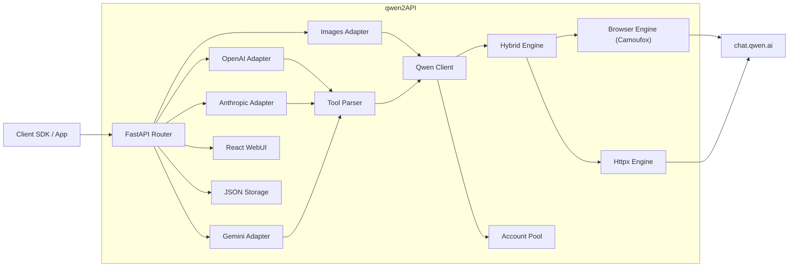

# qwen2API Enterprise Gateway

[](https://github.com/YuJunZhiXue/qwen2API/blob/main/LICENSE)
[](https://github.com/YuJunZhiXue/qwen2API/stargazers)
[](https://github.com/YuJunZhiXue/qwen2API/network/members)
[](https://github.com/YuJunZhiXue/qwen2API/releases)
[](https://hub.docker.com/r/yujunzhixue/qwen2api)

[](https://zeabur.com/templates/qwen2api)
[](https://vercel.com/new/clone?repository-url=https%3A%2F%2Fgithub.com%2FYuJunZhiXue%2Fqwen2API)

语言 / Language: [中文](./README.md) | [English](./README.en.md)

qwen2API 用于将通义千问（chat.qwen.ai）网页版能力转换为 OpenAI、Anthropic Claude 与 Gemini 兼容接口。项目后端基于 FastAPI，前端基于 React + Vite，内置管理台、账号池、工具调用解析、图片生成链路与多种部署方式。

---

## 目录

- [项目说明](#项目说明)
- [架构概览](#架构概览)
- [核心能力](#核心能力)
- [接口支持](#接口支持)
- [模型映射](#模型映射)
- [图片生成](#图片生成)
- [快速开始](#快速开始)
  - [方式一：Docker 直接运行预构建镜像（推荐）](#方式一docker-直接运行预构建镜像推荐)
  - [方式二：本地源码运行](#方式二本地源码运行)
- [环境变量说明（.env）](#环境变量说明env)
- [docker-compose.yml 说明](#docker-composeyml-说明)
- [端口说明](#端口说明)
- [WebUI 管理台](#webui-管理台)
- [数据持久化](#数据持久化)
- [常见问题](#常见问题)
- [许可证与免责声明](#许可证与免责声明)

---

## 项目说明

本项目提供以下能力：

1. 将千问网页对话能力转换为 OpenAI Chat Completions 接口。
2. 将千问网页对话能力转换为 Anthropic Messages 接口。
3. 将千问网页对话能力转换为 Gemini GenerateContent 接口。
4. 提供独立的图片生成接口 `POST /v1/images/generations`。
5. 支持工具调用（Tool Calling）与工具结果回传。
6. 提供管理台，用于账号管理、API Key 管理、图片生成测试与运行状态查看。
7. 提供多账号轮询、限流冷却、重试与浏览器 / httpx 混合引擎。

---

## 架构概览



---

## 核心能力

- OpenAI / Anthropic / Gemini 三套接口兼容。
- 工具调用解析与工具结果回传。
- Browser Engine、Httpx Engine、Hybrid Engine 三种执行模式。
- 多账号并发池、动态冷却、故障重试。
- 基于千问网页真实工具链路的图片生成。
- WebUI 管理台。
- 健康检查与就绪检查接口。

---

## 接口支持

| 接口类型 | 路径 | 说明 |
|---|---|---|
| OpenAI Chat | `POST /v1/chat/completions` | 支持流式与非流式、工具调用、图片意图自动识别 |
| OpenAI Models | `GET /v1/models` | 返回可用模型别名 |
| OpenAI Images | `POST /v1/images/generations` | 图片生成接口 |
| Anthropic Messages | `POST /anthropic/v1/messages` | Claude / Anthropic SDK 兼容 |
| Gemini GenerateContent | `POST /v1beta/models/{model}:generateContent` | Gemini SDK 兼容 |
| Gemini Stream | `POST /v1beta/models/{model}:streamGenerateContent` | 流式输出 |
| Admin API | `/api/admin/*` | 管理接口 |
| Health | `/healthz` | 存活探针 |
| Ready | `/readyz` | 就绪探针 |

---

## 模型映射

当前默认将主流客户端模型名称统一映射至 `qwen3.6-plus`。

| 传入模型名 | 实际调用 |
|---|---|
| `gpt-4o` / `gpt-4-turbo` / `gpt-4.1` / `o1` / `o3` | `qwen3.6-plus` |
| `gpt-4o-mini` / `gpt-3.5-turbo` | `qwen3.6-plus` |
| `claude-opus-4-6` / `claude-sonnet-4-6` / `claude-3-5-sonnet` | `qwen3.6-plus` |
| `claude-3-haiku` / `claude-haiku-4-5` | `qwen3.6-plus` |
| `gemini-2.5-pro` / `gemini-2.5-flash` / `gemini-1.5-pro` | `qwen3.6-plus` |
| `deepseek-chat` / `deepseek-reasoner` | `qwen3.6-plus` |

未命中映射表时，默认回退为传入模型名本身；若管理台设置了自定义映射规则，则以配置为准。

---

## 图片生成

qwen2API 提供与 OpenAI Images 接口兼容的图片生成能力。

- 接口：`POST /v1/images/generations`
- 默认模型别名：`dall-e-3`
- 实际底层：`qwen3.6-plus` + 千问网页 `image_gen` 工具
- 返回图片链接域名：通常为 `cdn.qwenlm.ai`

### 请求示例

```bash
curl http://127.0.0.1:7860/v1/images/generations \
  -H "Content-Type: application/json" \
  -H "Authorization: Bearer YOUR_API_KEY" \
  -d '{
    "model": "dall-e-3",
    "prompt": "一只赛博朋克风格的猫，霓虹灯背景，超写实",
    "n": 1,
    "size": "1024x1024",
    "response_format": "url"
  }'
```

### 返回示例

```json
{
  "created": 1712345678,
  "data": [
    {
      "url": "https://cdn.qwenlm.ai/output/.../image.png?key=...",
      "revised_prompt": "一只赛博朋克风格的猫，霓虹灯背景，超写实"
    }
  ]
}
```

### 支持的图片比例

前端图片生成页面内置以下比例：

- `1:1`
- `16:9`
- `9:16`
- `4:3`
- `3:4`

### Chat 接口图片意图识别

`/v1/chat/completions` 支持根据用户消息自动识别图片生成意图。例如：

- “帮我画一张……”
- “生成一张图片……”
- “draw an image of ……”

当识别为图片生成请求时，系统会自动切换到图片生成管道。

---

## 快速开始

### 方式一：Docker 直接运行预构建镜像（推荐）

此方式适用于生产环境、测试服务器与普通部署场景。  
优点是：**不需要本地编译前端，不需要在服务器构建镜像，不需要服务器自行下载 Camoufox。**

#### 第一步：准备目录

```bash
mkdir qwen2api && cd qwen2api
mkdir -p data logs
```

#### 第二步：创建 `docker-compose.yml`

```yaml
services:
  qwen2api:
    image: yujunzhixue/qwen2api:latest
    container_name: qwen2api
    restart: unless-stopped
    env_file:
      - path: .env
        required: false
    ports:
      - "7860:7860"
    volumes:
      - ./data:/workspace/data
      - ./logs:/workspace/logs
    shm_size: '256m'
    environment:
      PYTHONIOENCODING: utf-8
      PORT: "7860"
      ENGINE_MODE: "hybrid"
    healthcheck:
      test: ["CMD", "curl", "-f", "http://localhost:7860/healthz"]
      interval: 30s
      timeout: 10s
      start_period: 120s
      retries: 3
```

#### 第三步：创建 `.env`

建议至少写入以下内容：

```env
ADMIN_KEY=change-me-now
PORT=7860
WORKERS=1
ENGINE_MODE=hybrid
BROWSER_POOL_SIZE=2
MAX_INFLIGHT=1
ACCOUNT_MIN_INTERVAL_MS=1200
REQUEST_JITTER_MIN_MS=120
REQUEST_JITTER_MAX_MS=360
MAX_RETRIES=2
TOOL_MAX_RETRIES=2
EMPTY_RESPONSE_RETRIES=1
RATE_LIMIT_BASE_COOLDOWN=600
RATE_LIMIT_MAX_COOLDOWN=3600
STREAM_KEEPALIVE_INTERVAL=5
```

#### 第四步：启动服务

```bash
docker compose up -d
```

#### 第五步：查看状态

```bash
docker compose ps
docker compose logs -f
curl http://127.0.0.1:7860/healthz
```

#### 第六步：更新服务

```bash
docker compose pull
docker compose up -d
```

---

### 方式二：本地源码运行

此方式适用于本地开发与调试。

#### 环境要求

- Python 3.12+
- Node.js 20+
- 可访问 Camoufox 下载源

#### 步骤

```bash
git clone https://github.com/YuJunZhiXue/qwen2API.git
cd qwen2API
python start.py
```

`python start.py` 会自动完成以下工作：

1. 安装后端依赖
2. 下载 Camoufox 浏览器内核
3. 安装前端依赖
4. 构建前端
5. 启动后端服务

---

## 环境变量说明（.env）

项目提供 `.env.example` 作为模板。以下为主要参数说明。

### 基础参数

| 参数 | 默认值 | 说明 |
|---|---|---|
| `ADMIN_KEY` | `change-me-now` / `admin` | 管理台管理员密钥。建议部署后立即修改。 |
| `PORT` | `7860` | 后端服务监听端口。 |
| `WORKERS` | `1` 或 `3` | Uvicorn worker 数量。单实例环境建议 1。 |
| `REGISTER_SECRET` | 空 | 用户注册密钥。为空时表示不限制注册。 |

### 引擎参数

| 参数 | 默认值 | 说明 |
|---|---|---|
| `ENGINE_MODE` | `hybrid` | 引擎模式。可选 `hybrid`、`httpx`、`browser`。 |
| `BROWSER_POOL_SIZE` | `2` | 浏览器页面池大小。值越大并发越高，但内存占用也越高。 |
| `STREAM_KEEPALIVE_INTERVAL` | `5` | 流式输出 keepalive 间隔。 |

#### `ENGINE_MODE` 说明

- `hybrid`：推荐模式。聊天、建会话、删会话优先走浏览器；httpx 作为故障兜底。
- `httpx`：全部优先走 httpx / curl_cffi。速度更快，但浏览器特征更弱，适合对速度优先的测试场景。
- `browser`：全部走浏览器。更接近真实网页环境，但资源占用更高。

如果需要在 `httpx` 和 `hybrid` 之间切换，只需修改：

```env
ENGINE_MODE=httpx
```

或：

```env
ENGINE_MODE=hybrid
```

修改后重启服务：

```bash
docker compose restart
```

### 并发与风控参数

| 参数 | 默认值 | 说明 |
|---|---|---|
| `MAX_INFLIGHT` | `1` | 每个账号允许的最大并发请求数。 |
| `ACCOUNT_MIN_INTERVAL_MS` | `1200` | 同一账号两次请求之间的最小间隔。 |
| `REQUEST_JITTER_MIN_MS` | `120` | 随机抖动最小值。 |
| `REQUEST_JITTER_MAX_MS` | `360` | 随机抖动最大值。 |
| `MAX_RETRIES` | `2` | 请求失败最大重试次数。 |
| `TOOL_MAX_RETRIES` | `2` | 工具调用相关最大重试次数。 |
| `EMPTY_RESPONSE_RETRIES` | `1` | 空响应最大重试次数。 |
| `RATE_LIMIT_BASE_COOLDOWN` | `600` | 账号限流基础冷却时间（秒）。 |
| `RATE_LIMIT_MAX_COOLDOWN` | `3600` | 账号限流最大冷却时间（秒）。 |

### 数据路径参数

| 参数 | 默认值 | 说明 |
|---|---|---|
| `ACCOUNTS_FILE` | `/workspace/data/accounts.json` | 账号数据文件路径。 |
| `USERS_FILE` | `/workspace/data/users.json` | API Key / 用户数据文件路径。 |
| `CAPTURES_FILE` | `/workspace/data/captures.json` | 抓取结果文件路径。 |
| `CONFIG_FILE` | `/workspace/data/config.json` | 运行时配置文件路径。 |

---

## docker-compose.yml 说明

以下是推荐的 Compose 配置：

```yaml
services:
  qwen2api:
    image: yujunzhixue/qwen2api:latest
    container_name: qwen2api
    restart: unless-stopped
    env_file:
      - path: .env
        required: false
    ports:
      - "7860:7860"
    volumes:
      - ./data:/workspace/data
      - ./logs:/workspace/logs
    shm_size: '256m'
    environment:
      PYTHONIOENCODING: utf-8
      PORT: "7860"
      ENGINE_MODE: "hybrid"
    healthcheck:
      test: ["CMD", "curl", "-f", "http://localhost:7860/healthz"]
      interval: 30s
      timeout: 10s
      start_period: 120s
      retries: 3
```

### 字段说明

| 字段 | 说明 |
|---|---|
| `image` | 预构建镜像地址。普通部署推荐使用。 |
| `container_name` | 容器名称。 |
| `restart` | 开机或故障时自动重启。 |
| `env_file` | 从 `.env` 加载环境变量。 |
| `ports` | 将宿主机端口映射到容器端口。 |
| `volumes` | 持久化数据与日志目录。 |
| `shm_size` | 浏览器共享内存。Camoufox / Firefox 运行建议至少 256m。 |
| `environment` | Compose 中直接写入的环境变量，优先级高于镜像默认值。 |
| `healthcheck` | 容器健康检查。 |

### 用户需要修改的部分

通常只需要根据部署环境修改以下内容：

1. **端口映射**
   ```yaml
   ports:
     - "7860:7860"
   ```
   如果服务器 7860 已占用，可以改为：
   ```yaml
   ports:
     - "8080:7860"
   ```

2. **引擎模式**
   ```yaml
   environment:
     ENGINE_MODE: "hybrid"
   ```
   可改为：
   ```yaml
   environment:
     ENGINE_MODE: "httpx"
   ```

3. **共享内存**
   ```yaml
   shm_size: '256m'
   ```
   如果浏览器容易崩溃，可改为：
   ```yaml
   shm_size: '512m'
   ```

4. **数据挂载目录**
   ```yaml
   volumes:
     - ./data:/workspace/data
     - ./logs:/workspace/logs
   ```
   如需自定义存储路径，可替换左侧宿主机目录。

---

## 端口说明

### 为什么 Docker 部署前后端在同一个端口

Docker 镜像中已经构建好前端静态文件，并由后端统一托管：

- 后端 API：`http://host:7860/*`
- 前端管理台：`http://host:7860/`

因此 **Docker 部署时默认只有一个端口 7860**。

### 为什么本地开发时可能不是同一个端口

本地开发通常有两种方式：

1. **使用 `python start.py`**  
   前端会先构建为静态文件，再由后端统一托管。此时通常仍是一个端口。

2. **使用前端 Vite 开发服务器单独运行**  
   例如：
   - 前端：`http://localhost:5173`
   - 后端：`http://localhost:7860`

这种模式仅用于前端开发调试，不是生产部署模式。

---

## WebUI 管理台

管理台默认由后端托管，入口为：

```text
http://127.0.0.1:7860/
```

主要页面包括：

| 页面 | 说明 |
|---|---|
| 运行状态 | 查看整体服务状态、引擎状态与统计信息 |
| 账号管理 | 添加、测试、禁用、查看上游账号状态 |
| API Key | 管理下游调用密钥 |
| 接口测试 | 直接测试 OpenAI 对话接口 |
| 图片生成 | 图形化图片生成页面 |
| 系统设置 | 查看并修改部分运行时参数 |

---

## 数据持久化

默认数据目录：

- `data/accounts.json`：上游账号信息
- `data/users.json`：下游 API Key / 用户数据
- `data/captures.json`：抓取结果
- `data/config.json`：运行时配置
- `logs/`：运行日志

生产环境请务必持久化 `data/` 与 `logs/`。

---

## 常见问题

### 1. `.env` 不存在会怎样

如果 Compose 版本支持：

```yaml
env_file:
  - path: .env
    required: false
```

则 `.env` 不存在时仍可启动，使用镜像默认配置。  
但正式部署建议始终创建 `.env`，至少设置 `ADMIN_KEY`。

### 2. 服务器无法下载 Camoufox

请使用“Docker 直接运行预构建镜像”方式。  
该方式不依赖服务器下载浏览器内核，也不需要服务器本地构建镜像。

### 3. 图片生成返回 500 或 no URL found

排查步骤：

1. 确认上游账号在网页中可正常使用图片生成。
2. 查看日志中的 `[T2I]` 与 `[T2I-SSE]` 输出。
3. 确认部署的是最新镜像版本。
4. 确认前端页面未缓存旧资源。

### 4. `ENGINE_MODE` 选哪个

- 优先稳定性：`hybrid`
- 优先速度：`httpx`
- 优先网页拟态：`browser`

生产场景默认建议使用 `hybrid`。

---

## 许可证与免责声明

### 开源许可证

本项目采用 **MIT License** 发布。你可以根据 MIT License 的条款使用、复制、修改、分发本项目源代码，但必须保留原始版权声明与许可证文本。

### 使用范围说明

本项目用于协议兼容、接口转换、自动化测试与个人技术研究。项目本身不提供任何官方授权的通义千问商业接口服务。

### 免责声明

1. 本项目与阿里云、通义千问及相关官方服务无任何从属、代理或商业合作关系。
2. 本项目不是官方产品，也不构成任何官方服务承诺。
3. 使用者应自行评估所在地区的法律法规、上游服务条款、账号合规性与数据安全要求。
4. 因使用本项目导致的账号封禁、请求受限、数据丢失、服务中断、法律纠纷或其他风险，由使用者自行承担责任。
5. 项目维护者不对任何直接或间接损失承担责任。
6. 不建议将本项目用于违反上游服务条款、违反法律法规或存在明显合规风险的场景。

如果权利人认为本项目内容侵犯其合法权益，请通过仓库 Issue 或其他公开联系方式提出，维护者将在核实后处理。